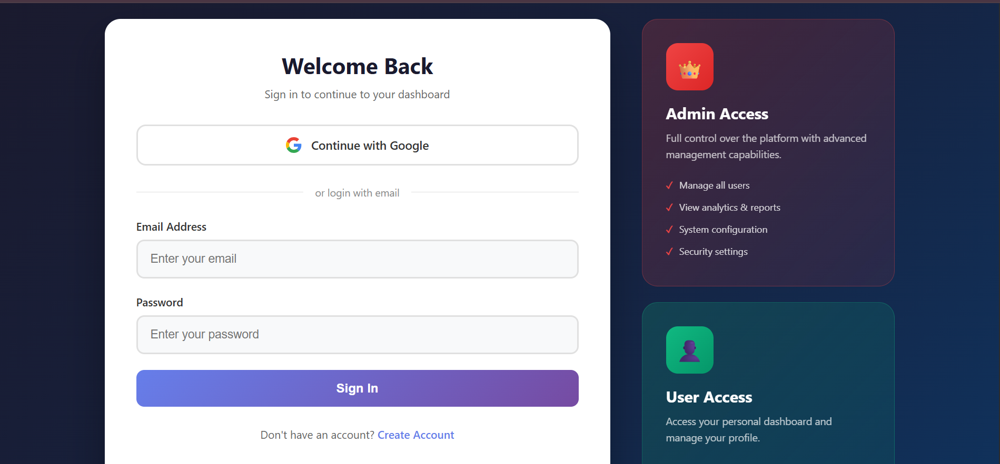
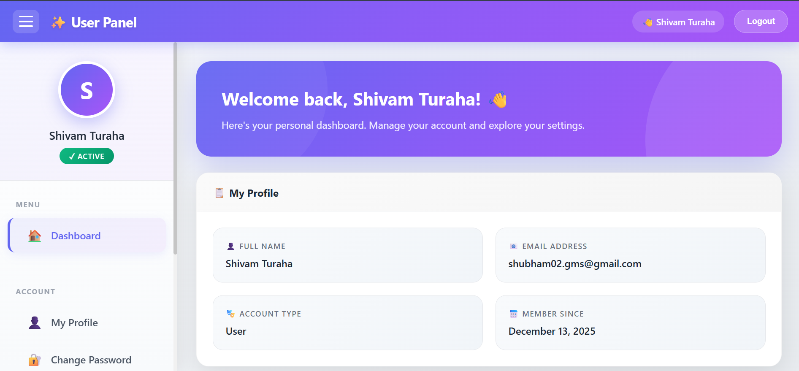

# 🍽 Laravel Management System

A full-stack Management System built with **Laravel**, featuring a secure **Admin Dashboard**,  
**Email Verification**, **Two-Factor Authentication (2FA)**, and a modern user interface.

This project demonstrates real-world Laravel development practices, authentication security,
and admin-level access control.

---

## 🚀 Features


### 🔐 Authentication
- Email verification
- Continue with Email flow
- Two-Factor Authentication (2FA)
- Secure login & logout

### 🛠 Admin Dashboard
- Secure admin login
- Role-based access
- Dashboard analytics
- Manage website content
- User management

---

## 🧑‍💻 Tech Stack

- **Backend:** Laravel
- **Frontend:** HTML, CSS, Bootstrap, JavaScript
- **Database:** MySQL
- **Authentication:** Laravel Auth, Email Verification, 2FA
- **Version Control:** Git & GitHub

---

## 📸 Screenshots

### Login with 2FA & Continue With Google 


### Admin Panel


### User Panel 



---

## ⚙️ Installation (Local Setup)

```bash
git clone https://github.com/USERNAME/REPO_NAME.git
cd project-folder
composer install
cp .env.example .env
php artisan key:generate
php artisan migrate
php artisan serve
